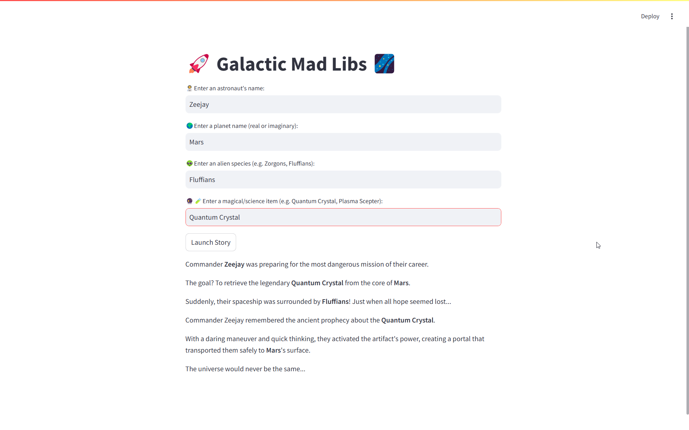

# 🚀 Galactic Mad Libs 🌌  

A fun, interactive **Mad Libs** game built with **Streamlit**! Customize your own **space adventure** by filling in the blanks with your own names, planets, alien species, and magical items. Let your creativity take off into the cosmos! 🌠  

## 🎮 Live Demo  
Run the app and create your **own sci-fi story** in seconds!  

---

## 📌 Features  
✅ **Interactive Input Fields** – Customize your story with unique names & objects.  
✅ **Dynamic Story Generation** – Instantly see your personalized space tale.  
✅ **Streamlit-Powered UI** – Simple, fast, and user-friendly interface.  

---

## 🚀 How to Run  

### 1️⃣ Clone the Repository  
```bash
git clone https://github.com/zohaib-javd/mad_lib_game.git
cd mad_lib_game
```

### 2️⃣ Install Dependencies  
```bash
pip install streamlit
```

### 3️⃣ Run the App  
```bash
streamlit run app.py
```

---

## 🛠 Technologies Used  
- **Python** 🐍  
- **Streamlit** 🎨  

---

## 📸 Screenshot  
  

---

## 📜 Example Story  
*Commander Zeejay was preparing for the most dangerous mission of their career.*  
*The goal? To retrieve the legendary Quantum Crystal from the core of Mars.*  
*Suddenly, their spaceship was surrounded by Fluffians! Just when all hope seemed lost...*  
*Commander Zeejay remembered the ancient prophecy about the Quantum Crystal.*  
*With a daring maneuver and quick thinking, they activated the artifact's power, creating a portal that transported them safely to Mars's surface.*  
*The universe would never be the same...*  

---

## 🎯 Future Enhancements  
- 🌌 Add AI-generated plot twists  
- 🎨 Improve UI with custom themes  
- 🔊 Text-to-speech storytelling  

---

## 🎉 Contribute  
Want to improve **Galactic Mad Libs**? Feel free to **fork** this project, make updates, and submit a **pull request**! 🚀  

---

## 📩 Contact  
Have feedback or ideas? Let's connect!  
linkedin: https://www.linkedin.com/in/zohaib-javd
